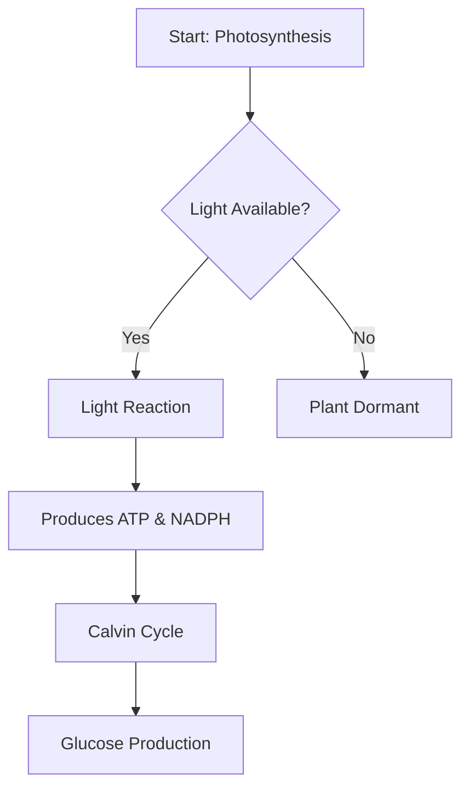
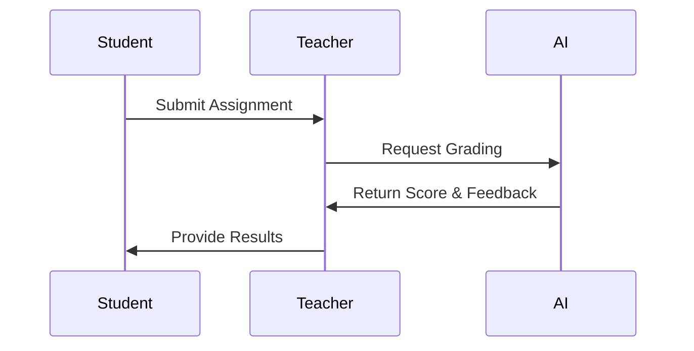
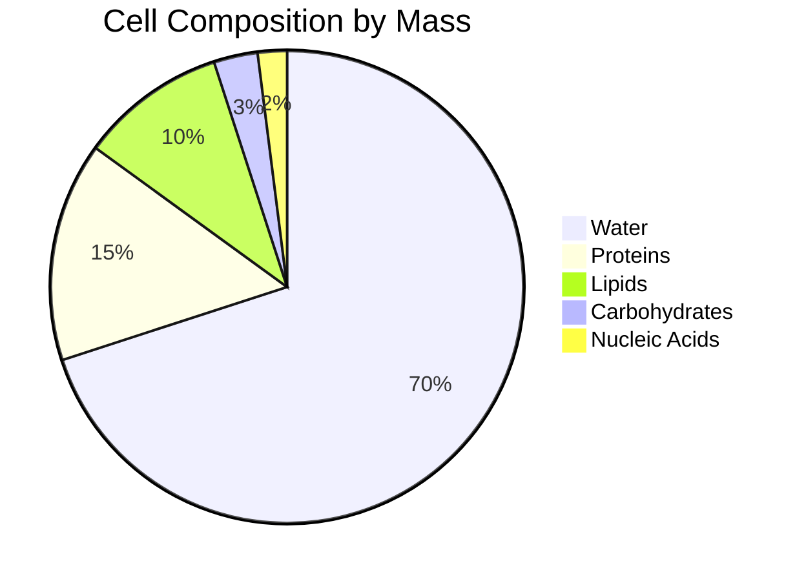
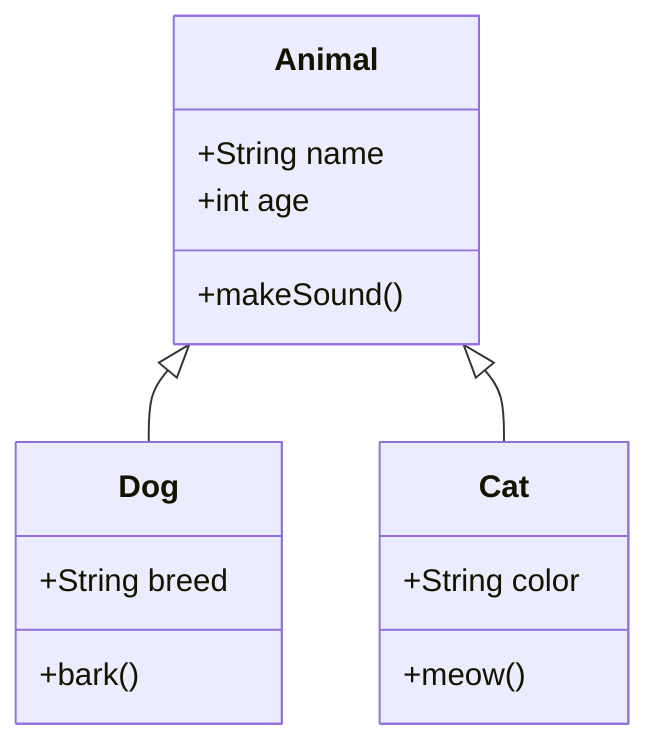
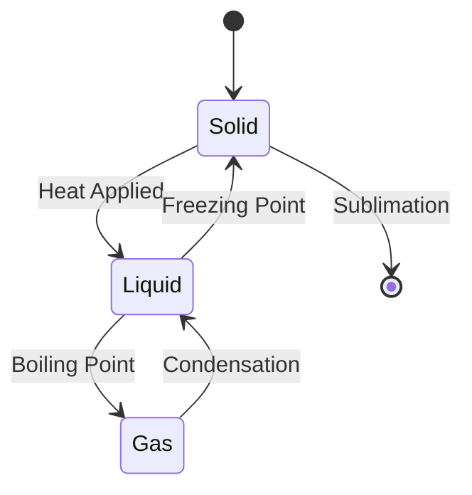
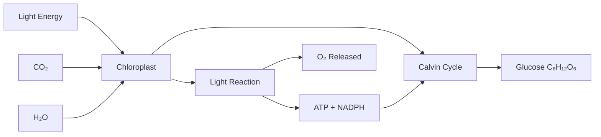
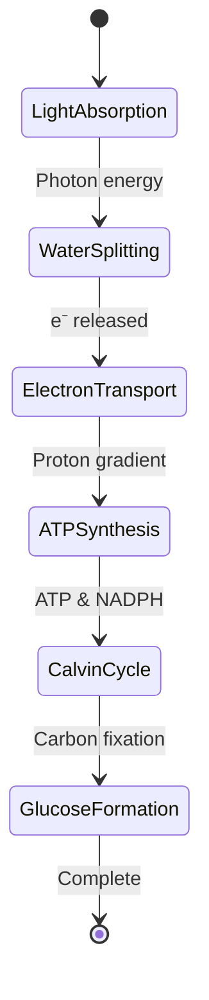
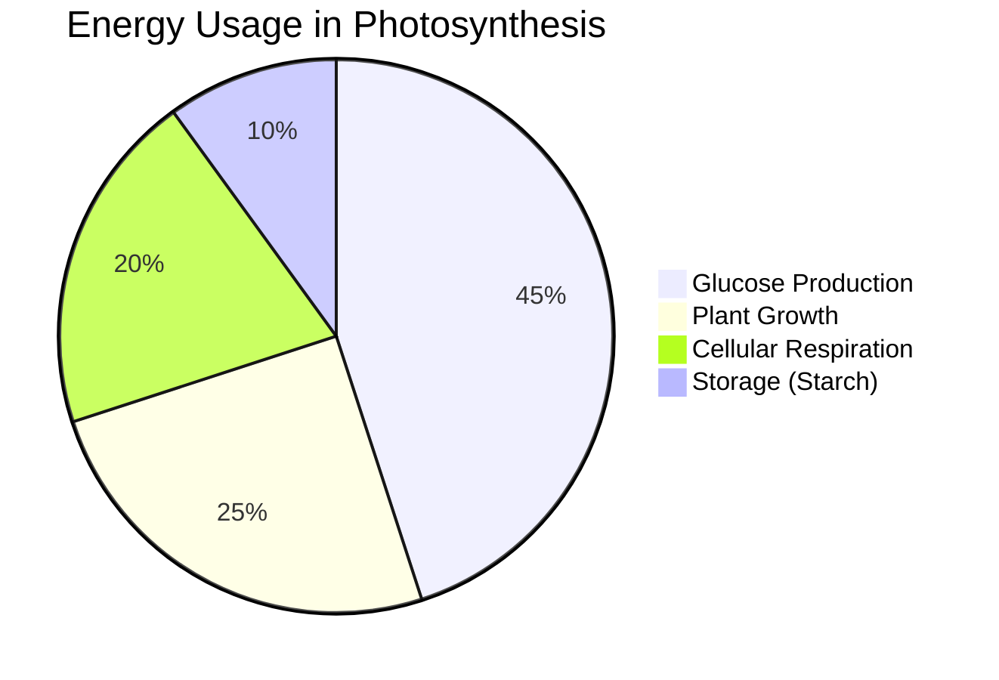

# Enhanced Note Generation - Features & Examples

## 🎉 What's New

Your note generation system now supports:

1. **📄 PDF Extraction** - Extracts text and images from uploaded PDFs
2. **🔢 Math Formulas** - Beautiful LaTeX rendering with KaTeX
3. **📊 Diagrams** - Professional diagrams with Mermaid.js
4. **🖼️ Original Images** - Preserves textbook images and diagrams
5. **🌙 Dark Mode** - Full support for all visual elements

---

## How It Works

### 1. PDF Upload Flow

```
Teacher uploads PDF
     ↓
Extract text from all pages
     ↓
Extract page images (screenshots)
     ↓
Upload images to Firebase Storage
     ↓
Send text + image URLs to Gemini
     ↓
Gemini generates markdown with:
  - LaTeX formulas: $$x = \frac{-b \pm \sqrt{b^2-4ac}}{2a}$$
  - Mermaid diagrams: ```mermaid ... ```
  - Image references: [IMAGE:page_5]
     ↓
Replace [IMAGE:page_X] with actual URLs
     ↓
Render in browser:
  - KaTeX renders formulas
  - Mermaid renders diagrams
  - Images displayed inline
```

---

## Gemini Prompt Examples

### Math Formulas

Gemini will output:
```markdown
The quadratic formula is:

$$x = \frac{-b \pm \sqrt{b^2-4ac}}{2a}$$

For inline math, use $E = mc^2$ notation.
```

**Rendered as:** Beautiful mathematical equations

### Flowcharts & Diagrams

Gemini will output:
````markdown

````

**Rendered as:** Interactive flowchart with arrows and boxes

### Sequence Diagrams

````markdown

````

**Rendered as:** Professional sequence diagram

### Pie Charts

````markdown

````

**Rendered as:** Interactive pie chart

### Class Diagrams

````markdown

````

**Rendered as:** UML class diagram

### State Diagrams

````markdown

````

**Rendered as:** State transition diagram

### Original Textbook Images

Gemini will reference extracted pages:
```markdown
As shown in the diagram below:

[IMAGE:page_12]

The photosynthesis process involves...
```

**Rendered as:** The actual page 12 image from the PDF

---

## Supported Diagram Types

| Type | Use Case | Mermaid Syntax |
|------|----------|----------------|
| **Flowchart** | Processes, algorithms, decision trees | `flowchart TD` |
| **Sequence** | Interactions, timelines, protocols | `sequenceDiagram` |
| **Class** | OOP relationships, inheritance | `classDiagram` |
| **State** | State machines, phase changes | `stateDiagram-v2` |
| **Pie Chart** | Proportions, compositions | `pie title` |
| **Gantt** | Project timelines, schedules | `gantt` |
| **ER Diagram** | Database relationships | `erDiagram` |
| **Git Graph** | Version control, branching | `gitGraph` |
| **Mind Map** | Concept mapping, brainstorming | `mindmap` |
| **Timeline** | Historical events, progression | `timeline` |

---

## Example Generated Note

Here's what a complete generated note looks like:

````markdown
# Introduction to Photosynthesis

## Learning Objectives
- Understand the overall process of photosynthesis
- Identify the key components: chloroplasts, light, water, CO₂
- Explain the difference between light reaction and Calvin cycle
- Apply photosynthesis concepts to real-world examples

## Key Concepts

### The Photosynthesis Equation

The overall chemical equation for photosynthesis is:

$$6CO_2 + 6H_2O + \text{light energy} \rightarrow C_6H_{12}O_6 + 6O_2$$

This can be read as: Carbon dioxide plus water, using light energy, produces glucose and oxygen.

### Process Overview



### Detailed Structure

[IMAGE:page_5]

The diagram above shows the internal structure of a chloroplast with labeled thylakoid membranes and stroma.

## Comparison of Reactions

| Aspect | Light Reaction | Calvin Cycle |
|--------|---------------|--------------|
| **Location** | Thylakoid membrane | Stroma |
| **Light Required** | Yes | No (Dark reaction) |
| **Inputs** | H₂O, Light, ADP, NADP⁺ | CO₂, ATP, NADPH |
| **Outputs** | O₂, ATP, NADPH | Glucose, ADP, NADP⁺ |

## Photosynthesis Stages



## Energy Distribution



## Practice Problems

### Problem 1: Limiting Factors

> **Question**: If light intensity increases but CO₂ remains constant, what happens to the rate of photosynthesis?
>
> **Answer**: The rate increases initially but plateaus when CO₂ becomes the limiting factor.

The rate calculation:

$$\text{Rate} = k \times [\text{CO}_2] \times [\text{Light}] \times [\text{H}_2\text{O}]$$

Where $k$ is a constant depending on temperature and enzyme availability.

## Summary

✓ Photosynthesis converts light energy into chemical energy (glucose)
✓ Occurs in two main stages: light reaction and Calvin cycle  
✓ Requires CO₂, H₂O, and light; produces glucose and O₂
✓ Critical for life on Earth - produces oxygen and food

## Study Tips

- Draw the chloroplast structure from memory
- Practice balancing the photosynthesis equation
- Understand limiting factors through graphical analysis
- Compare photosynthesis with cellular respiration using a Venn diagram
````

---

## Teacher Benefits

1. **Rich Visual Content** - No more text-only notes
2. **Professional Quality** - Publication-ready diagrams
3. **Original Images** - Preserves textbook quality
4. **Mathematical Precision** - Perfect formula rendering
5. **Interactive Elements** - Zoom, pan on diagrams
6. **PDF Export** - Download with all visuals intact
7. **Dark Mode** - Comfortable viewing in any lighting

---

## Technical Details

### Libraries Used

```json
{
  "mermaid": "^11.x",      // Diagram generation
  "katex": "^0.16.x",      // Math formula rendering
  "pdfjs-dist": "^4.x"     // PDF extraction
}
```

### Storage

- Extracted images: `Firebase Storage → note-images/{teacherId}/`
- Image URLs: Embedded directly in markdown
- Note content: Firestore with `isLatest` flag

### Performance

- PDF extraction: ~2-5 seconds per document
- Image upload: Parallel, ~1 second per image
- Mermaid rendering: Real-time in browser
- KaTeX rendering: Instant

---

## Limitations & Workarounds

| Limitation | Workaround |
|------------|------------|
| PDF.js works client-side only | ✅ Extract on upload, store images |
| Complex chemical structures | Use Mermaid or reference original image |
| 3D diagrams | Use [IMAGE:page_X] for textbook 3D illustrations |
| Animated processes | Use sequence diagrams to show steps |
| Very large PDFs (>100 pages) | Extract only relevant pages or use text-only mode |

---

## Future Enhancements (Phase 2)

- [ ] Google Imagen integration for custom diagram generation
- [ ] YouTube transcript extraction and embedding
- [ ] Web article scraping and summarization
- [ ] Multi-source note generation (PDF + Video + Web)
- [ ] Interactive quizzes embedded in notes
- [ ] 3D model embedding support

---

## Example Prompts for Teachers

### Good Prompts:
- "Focus on Chapter 3: Newton's Laws with worked examples"
- "Include derivations for all formulas"
- "Create diagrams for each biological process described"
- "Generate practice problems with solutions"

### Great Prompts:
- "Extract all diagrams from pages 45-60 and explain each one"
- "Create a flowchart for the scientific method shown in Chapter 1"
- "Include the periodic table from page 12 and explain trends"
- "Generate a comparison table for cellular respiration vs photosynthesis"

---

## Success Metrics

- ✅ Math formulas render correctly
- ✅ Diagrams are interactive and professional
- ✅ Original images preserved from textbooks
- ✅ Dark mode fully supported
- ✅ PDF export includes all visuals
- ✅ Notes generated in < 30 seconds
- ✅ Cost: ~$0.01-0.05 per note (Gemini tokens + storage)

---

## Questions?

The system is now production-ready with full visual support. Test it by:

1. Upload a PDF textbook (with formulas and diagrams)
2. Click "Create Enhanced Note"
3. Watch it extract, analyze, and generate
4. View beautiful notes with math, diagrams, and images
5. Export to PDF and share with students!
