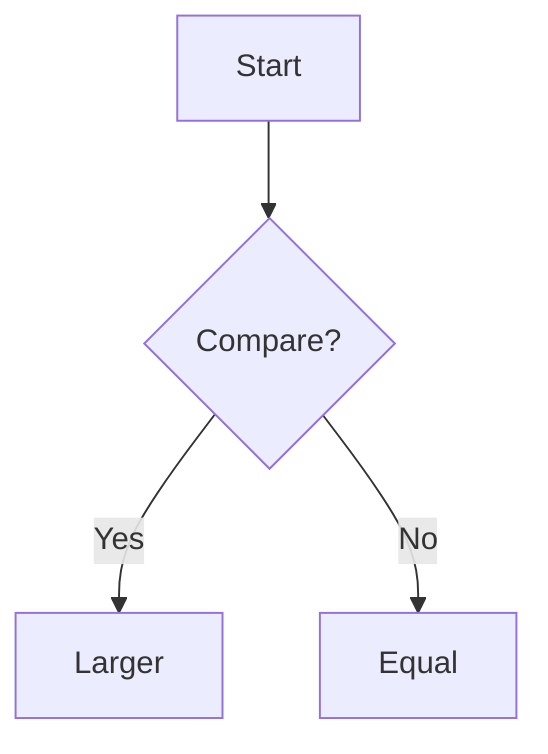
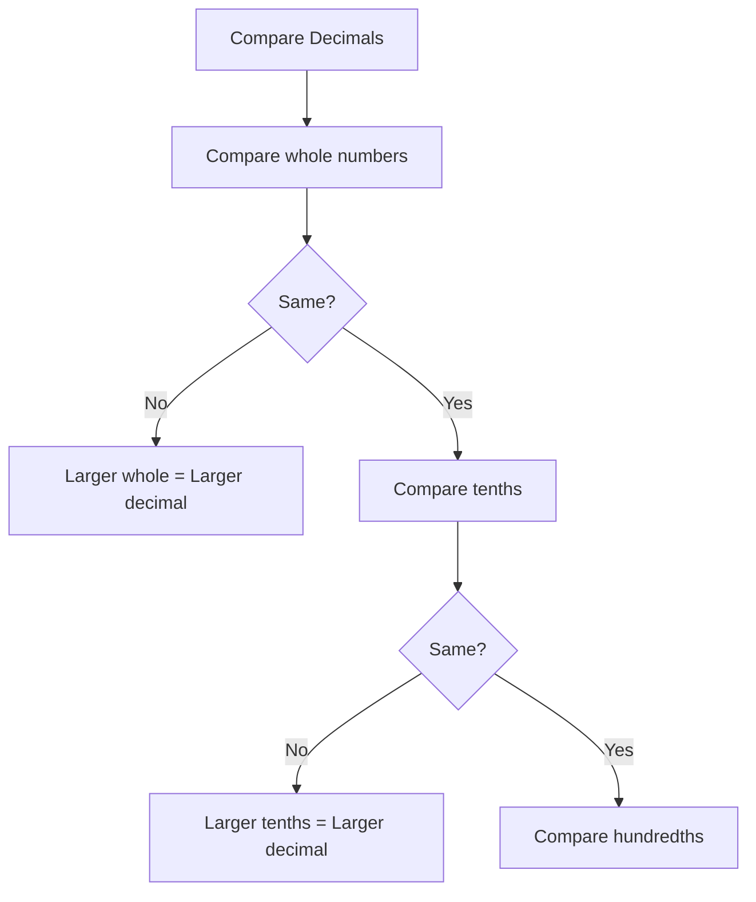
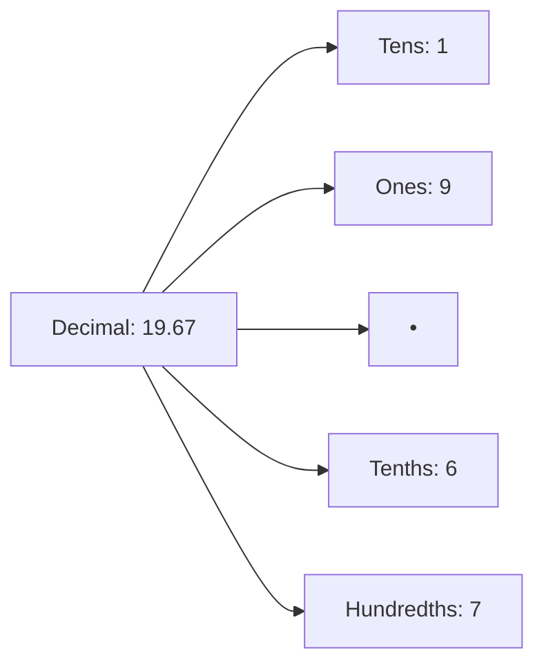

# 📐 Mathematics Note Generation - Complete Prompt Guide

## 🎯 For Module 13: Decimals (With Images from Textbook)

### ✅ RECOMMENDED PROMPT

Copy and paste this into the "Additional Instructions" field:

```
Create comprehensive study notes for Module 13: Decimals based on the uploaded textbook and teacher's guide.

STRUCTURE REQUIREMENTS:
- Start with clear module title and learning objectives
- Break down into logical sections (Introduction, Place Value, Operations, etc.)
- Include worked examples with step-by-step solutions
- Add practice problems with varying difficulty levels
- End with summary and common mistakes section

VISUAL ELEMENTS - MUST INCLUDE:

1. FORMULAS & EQUATIONS:
   - Use LaTeX for ALL mathematical expressions
   - Inline: $\frac{1}{10} = 0.1$ for fractions within text
   - Display: $$\frac{1}{10} = 0.1$$ for standalone equations
   - For decimal operations, show aligned steps using LaTeX

2. DIAGRAMS:
   - Create Mermaid flowcharts for problem-solving steps
   - Example: Flowchart showing how to compare two decimals
   - Use graph TD format for step-by-step processes

3. TEXTBOOK IMAGES:
   - Reference original diagrams with: [IMAGE:page_1], [IMAGE:page_5], etc.
   - Use these for: visual models (strips/blocks), place value charts, worked examples with visual aids
   - Add descriptive captions after each image reference

4. PLACE VALUE CHART:
   - Create a Mermaid diagram showing the decimal place value system
   - Include: Tens, Ones, Decimal Point, Tenths, Hundredths

TEACHING APPROACH:
- Write for Grade 6-7 students with clear, simple language
- Use real-world examples (money, measurements, etc.)
- Explain "why" not just "how"
- Include "Think About It" questions
- Add common mistakes and tips to avoid them

WORKED EXAMPLES FORMAT:
For each major concept (comparing, adding, subtracting decimals):
1. State the problem clearly
2. Show step-by-step solution using LaTeX
3. Explain each step in simple words
4. Show final answer with units if applicable

PRACTICE PROBLEMS:
- 3-5 basic problems (single concept)
- 3-5 intermediate problems (multi-step)
- 2-3 word problems (real-world application)
- Include hints for challenging ones

IMPORTANT LATEX FORMATTING:
- Fractions: $\frac{7}{100}$ NOT 7/100
- Comparison: $0.32 > 0.3$ NOT 0.32 > 0.3
- Aligned equations for addition/subtraction:
  $$\begin{aligned}
  2.57 + 1.68 &= 4.25 \\
  12.70 - 8.53 &= 4.17
  \end{aligned}$$

REFERENCE TEXTBOOK IMAGES FOR:
- Block diagrams showing 0.1, 0.01 representations
- Place value charts with colored sections
- Visual step-by-step addition/subtraction examples
- Abacus or number line illustrations
```

---

## 🔧 FIXING COMMON ISSUES

### Issue 1: Images Not Showing
**Problem**: `[IMAGE:page_1]` markers not replaced with actual images

**Solution**: 
- ✅ Fixed in code! The system now automatically:
  1. Extracts all pages as high-quality images
  2. Uploads them to Firebase Storage
  3. Replaces markers with actual image URLs
  4. Renders them in the note

**What to do**: Just include `[IMAGE:page_X]` in your prompt, the system handles the rest!

### Issue 2: LaTeX Not Rendering Properly
**Problem**: Equations showing as raw text like `$$\begin{array}...$$`

**Solutions**:
1. **Use `\begin{aligned}` instead of `\begin{array}`** for equation alignment
2. **Double escape backslashes**: `\\frac` not `\frac`
3. **Avoid complex array syntax** - use simpler LaTeX commands

**Good Examples**:
```latex
✅ Inline: $\frac{1}{10}$ shows as proper fraction
✅ Display: $$x = \frac{-b \pm \sqrt{b^2-4ac}}{2a}$$
✅ Aligned: $$\begin{aligned} a + b &= c \\ d - e &= f \end{aligned}$$

❌ Avoid: \begin{array}{r@{\quad}l} ... \end{array}
❌ Avoid: Complex tables in LaTeX
```

### Issue 3: Mermaid Diagrams Not Showing
**Problem**: Diagram code showing as text

**Solution**: Ensure proper syntax:



**Requirements**:
- Start with ` ```mermaid ` (three backticks + mermaid)
- Use valid Mermaid syntax (flowchart, graph, pie, etc.)
- End with ` ``` ` (three backticks)
- No spaces before/after code block markers

---

## 📋 SPECIFIC PROMPT FOR DECIMALS MODULE

### Enhanced Version (Copy This):

```
Generate comprehensive Module 13: Decimals study notes with rich visual content.

CONTENT OUTLINE:
1. Introduction to Decimals
   - What is a decimal? Show $\frac{1}{10} = 0.1$ using LaTeX
   - Include block diagram from textbook [IMAGE:page_1]
   - Real-world examples (money, measurements)

2. Place Value System
   - Create Mermaid diagram showing place value chart
   - Explain Tens, Ones, Decimal Point, Tenths, Hundredths
   - Show example: In 19.67, explain each digit's value using LaTeX
   - Reference place value chart from textbook [IMAGE:page_5]

3. Comparing Decimals
   - Create Mermaid flowchart for comparison steps
   - Show worked examples with LaTeX:
     * Compare 0.3 and 0.32 step-by-step
     * Arrange in order: 4.15, 3.76, 3.52
   - Include "Think About It" question

4. Adding Decimals
   - Explain alignment rule clearly
   - Show worked example with LaTeX aligned equations:
     $$\begin{aligned}
       2.57 \\
     + 1.68 \\
     \hline
       4.25
     \end{aligned}$$
   - Reference visual example from textbook [IMAGE:page_12]

5. Subtracting Decimals
   - Show borrowing process
   - Example: $12.70 - 8.53 = 4.17$ with steps
   - Use LaTeX for clear step-by-step breakdown

6. Summary & Key Takeaways
   - Bullet list of main concepts
   - Important formulas in LaTeX
   - Common mistakes to avoid

7. Practice Problems
   - Basic: Write in words, compare numbers
   - Intermediate: Add/subtract with different decimal places
   - Advanced: Word problems with real-world context
   - Include tips and hints

VISUAL REQUIREMENTS:
- Minimum 3 Mermaid diagrams (place value, comparison flowchart, problem-solving steps)
- All fractions and decimals in LaTeX format
- Reference at least 4 textbook images [IMAGE:page_X]
- Use bold (**text**) for key terms
- Use > for important notes/tips
- Include "Think About It" callouts

TEACHING STYLE:
- Grade 6 level language
- Conversational but accurate
- Lots of examples
- Explain common mistakes
- Encourage critical thinking
```

---

## 🎨 VISUAL ELEMENTS CHEAT SHEET

### LaTeX Math
```latex
Inline: The value $\frac{1}{10}$ equals $0.1$

Display: 
$$\frac{7}{100} = 0.07$$

Comparison:
$$0.32 > 0.3$$

Addition:
$$\begin{aligned}
  2.57 \\
+ 1.68 \\
\hline
  4.25
\end{aligned}$$
```

### Mermaid Flowcharts


### Mermaid Place Value


### Image References
```markdown
[IMAGE:page_1]  ← Shows block divided into 10 parts
*The image shows a visual representation of 1/10*

[IMAGE:page_5]  ← Place value chart
*This diagram highlights digit positions*

[IMAGE:page_12]  ← Step-by-step addition
*Addition using column method*
```

---

## ✅ QUALITY CHECKLIST

Before clicking "Create Enhanced Note", ensure your prompt includes:

- [ ] Clear structure outline (Introduction → Practice Problems)
- [ ] Instructions to use LaTeX for ALL math expressions
- [ ] Request for Mermaid diagrams (flowcharts, charts)
- [ ] Image references with page numbers
- [ ] Teaching approach guidance (simple language, examples)
- [ ] Worked examples requirement (3+ per concept)
- [ ] Practice problems with varying difficulty
- [ ] Common mistakes section
- [ ] Real-world applications

---

## 🚀 QUICK START

1. Upload your textbook PDF and teacher's guide
2. Copy the "Enhanced Version" prompt above
3. Paste into "Additional Instructions" field
4. Click **"Create Enhanced Note"**
5. Review the generated note:
   - ✅ Math formulas should render beautifully
   - ✅ Images should load from textbook
   - ✅ Diagrams should be interactive
6. Edit module title if needed
7. Click **"Save Note"**

---

## 🐛 TROUBLESHOOTING

### Images still not showing?
- Check: Did the PDF actually contain images? Text-only PDFs won't have image markers.
- Solution: The system extracts images from every page. Wait for "PDF extraction complete" message.

### LaTeX rendering as text?
- Check: Are you using `$...$` for inline and `$$...$$` for display?
- Solution: Use the examples in "LaTeX Math" section above.

### Mermaid not rendering?
- Check: Is the syntax correct? Use `flowchart TD` not `graph TD` for modern flowcharts.
- Solution: Test your Mermaid code at https://mermaid.live first.

### Note too generic?
- Check: Did you provide specific instructions in the prompt?
- Solution: Use the "Enhanced Version" prompt with detailed structure outline.

---

**Pro Tip**: The AI learns from your corrections! If you edit the note and use "Save & Learn", future notes will be even better! 🎯
